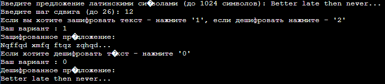

#Lab3
## Цикл «счётчик» - for
_____
### Описание программы
Пользователь вводит строку(латиница) и шаг сдвига. Шаг может быть как положительным, так и отрицательным для расшифровки. У пользователя есть выбор: шифровать или дешифровать строку. Далее ему будет предоставлена возможность расшифровать код.
_____
### Скриншот выходных данных

_____
### Среда разработки
Программа написана на языке С++. Программу можно запустить через онлайн-компилятор [OnlineJBD](https://onlinegdb.com/td5KMSmOC)
